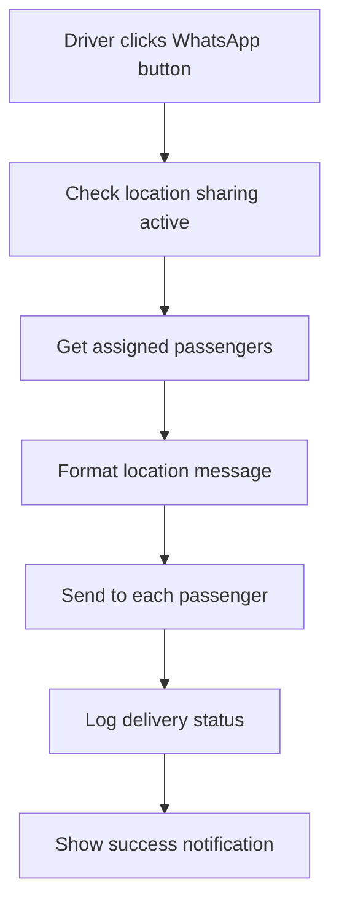

# WhatsApp Location Sharing Setup Guide

## 🚀 Quick Setup

Your WhatsApp location sharing feature is **ready to use** with basic functionality! Here's what you get out of the box:

### ✅ Current Features
- **WhatsApp Location Button** on driver dashboard
- **Automatic passenger detection** from today's bookings
- **Enhanced location messages** with driver and vehicle details
- **Google Maps integration** with direct links and directions
- **Logging system** for tracking message delivery
- **Fallback notifications** if WhatsApp fails

## 📱 How It Works

1. **Driver starts location sharing** (green location button)
2. **Driver clicks WhatsApp button** (green WhatsApp button)
3. **System sends location** to all assigned passengers
4. **Passengers receive** Rich WhatsApp message with:
   - Driver name and contact
   - Vehicle details (plate, type, color)
   - Live Google Maps link
   - Direct directions link
   - Timestamp

## 🔧 Production Setup Options

### Option 1: Twilio WhatsApp API (Recommended)
```php
// In whatsapp_location_sender.php, uncomment and configure:
$twilio_sid = 'your_twilio_sid';
$twilio_token = 'your_twilio_token';
$twilio_whatsapp_number = 'whatsapp:+14155238886';
```

**Benefits:**
- Official WhatsApp Business API
- High delivery rates
- Professional sender number
- Message templates support

**Setup:**
1. Sign up at [Twilio.com](https://twilio.com)
2. Get WhatsApp Business API access
3. Add credentials to the code

### Option 2: Third-party WhatsApp Service
```php
// Alternative services to integrate:
// - MessageBird WhatsApp API
// - Infobip WhatsApp Business
// - WhatsApp Cloud API (Meta)
// - ChatAPI.com
```

### Option 3: WhatsApp Web Automation
- Use browser automation tools
- Selenium WebDriver integration
- Requires desktop/server setup

## 🧪 Testing

1. **Create test booking** for today:
   ```
   http://localhost/Southrift%20Services/update_booking_for_testing.php
   ```

2. **Login as driver** and test:
   - Start location sharing
   - Click WhatsApp button
   - Check browser console for logs

3. **Check database logs**:
   ```sql
   SELECT * FROM location_share_log ORDER BY created_at DESC;
   ```

## 📋 Message Format

The WhatsApp message includes:
```
🚗 *SouthRift Services - Live Location Update*

👨‍✈️ Driver: John Doe
🚙 Vehicle: KCA 123A (Sedan) - White
📞 Contact: +254712345678

📢 *Message:* Custom message here (if provided)

📍 *Current Location:*
https://www.google.com/maps?q=lat,lng

🧭 *Get Directions:*
https://www.google.com/maps/dir/?api=1&destination=lat,lng

🕒 Updated: 14:30:25 24/09/2025

_Track your ride in real-time!_
```

## 🔒 Security Features

- **CSRF token protection**
- **Session validation**
- **Driver-passenger assignment verification**
- **Rate limiting** (0.5s delay between messages)
- **Error logging** and handling

## 📊 Analytics

The system logs all WhatsApp attempts:
- Success/failure rates
- Delivery timestamps
- Driver and passenger mapping
- Location coordinates sent

## 🔄 Integration Workflow



## 🚫 Troubleshooting

**Error: "No assigned passengers found"**
- Check if bookings exist for today
- Verify passenger phone numbers in database
- Run the test booking script

**Error: "Please start location sharing first"**
- Driver must click green location button first
- Ensure GPS permissions are granted

**Error: "Failed to send WhatsApp location"**
- Check PHP error logs
- Verify database connection
- Ensure WhatsApp API credentials are correct

## 🔄 Next Steps

1. **Choose WhatsApp API provider** (Twilio recommended)
2. **Configure credentials** in `whatsapp_location_sender.php`
3. **Test with real phone numbers**
4. **Monitor delivery logs**
5. **Set up webhook notifications** (optional)

Your system is ready to send WhatsApp location updates! 🎉